# UX Dokumentacija — MatchTrack

## 1) **Personas**

### **Persona 1 — Marko (Organizator / Kapetan)**

- **Ime:** Marko K.  
- **Dob:** 28  
- **Grad:** Zagreb  
- **Uloga:** Organizator termina / kapetan ekipe  
- **Zanimanje:** Inženjer informatike  
- **Tehnički profil:** Visoko digitalno pismen; koristi WhatsApp/Telegram, Google Calendar/Sheets  

**Ciljevi:**  
- Brz i jasan proces kreiranja termina  
- Automatizirani podsjetnici  
- Evidencija rezultata  

**Frustracije:**  
- Kaos u chat grupama  
- Kasna odustajanja  
- Ručne tablice  

**Kontekst:**  
- Desktop (planiranje)  
- Mobitel (potvrde)  

**Ključni zadaci:**  
- Kreiranje/uređivanje termina  
- Pozivanje ekipe  
- Podjela timova  
- Unos rezultata  

**Metrike uspjeha:** Popunjenost, trend dolazaka, broj odustajanja  
**Osobine:** Savjesnost visoka; ekstraverzija srednje-visoka; stabilnost srednje-visoka  

---

### **Persona 2 — Ivana (Povremena igračica / Rekreativka)**

- **Ime:** Ivana P.  
- **Dob:** 24  
- **Grad:** Split  
- **Uloga:** Povremena igračica / rekreativka  
- **Zanimanje:** Studentica marketinga  
- **Tehnički profil:** Mobilno orijentirana; voli push notifikacije; brze akcije  

**Ciljevi:**  
- Jednim klikom prijava/odjava  
- Jasna lokacija/vrijeme  
- Dodavanje u kalendar  
- Navigacija  

**Frustracije:**  
- Nepreglednost informacija u chatu  
- Nejasni rokovi za prijavu  

**Kontekst:** Mobitel, često u zadnji čas  
**Ključni zadaci:** Prijava/odjava, pregled tko dolazi, dodavanje u kalendar  
**Metrike uspjeha:** Broj dolazaka, prisutnost prijatelja, jednostavnost korištenja  
**Osobine:** Ekstraverzija visoka; otvorenost visoka; ugodnost visoka  

---

### **Persona 3 — Dino (Kompetitivni / Statistički orijentiran igrač)**

- **Ime:** Dino R.  
- **Dob:** 33  
- **Grad:** Osijek  
- **Uloga:** Kompetitivni igrač (fokus na brojke)  
- **Zanimanje:** Prodajni savjetnik  
- **Tehnički profil:** Srednje napredan; koristi fitness/stat aplikacije  

**Ciljevi:**  
- Evidencija golova, asistencija i MVP-a  
- Usporedbe s drugima  
- Praćenje napretka kroz vrijeme  

**Frustracije:** Nedostatak strukturirane statistike, podaci se gube u chatu  
**Kontekst:** Mobitel nakon utakmice (unos); desktop za analitiku  
**Ključni zadaci:** Brz unos strijelaca/asistencija; pregled trendova i poredaka  

---

## 2) **Card Sorting i Informacijska Arhitektura**

### **Metoda**
- **Tip:** Open card sorting (sudionici slobodno grupiraju kartice i imenuju grupe)  
- **Sudionici:** 10 (miks uloga sličnih personama)  
- **Alat:** Optimal Workshop / Miro / Figma  

---

### **Ulazne kartice (~28)**  
- **Planiranje termina:** Kreiraj termin, Datum/vrijeme, Lokacija, Cijena/participacija, Maks broj igrača, Lista čekanja, Rok za prijavu, Pozovi igrače, Link za poziv, Podsjetnici/Notifikacije  
- **Izvedba termina:** Popis prijavljenih, Podjela timova, Chat termina, Navigacija do lokacije  
- **Rezultati:** Unos rezultata, Strijelci, Asistencije, Ocjene igrača, MVP  
- **Statistika:** Moji dolasci, Moji golovi, Moje asistencije, Leaderboard, Statistika ekipe  
- **Osobe i grupe:** Popis igrača, Profil igrača, Moji prijatelji, Grupe/ekipe, Upravljanje članovima, Pravila igre  
- **Lokacije:** Dvorane/tereni, Favoriti, Recenzije lokacija  
- **Postavke/podrška:** Moj profil, Postavke, Pomoć/FAQ  
- **Plaćanja:** Plaćanje/račun, Evidencija uplate  

---

### **Konsolidirane kategorije (rezultat card sorta)**
- **Termini** (planiranje, izvedba, rezultati)  
- **Statistika** (osobna, ekipna, poretci)  
- **Igrači** (popis, profili, prijatelji)  
- **Grupe/Ekipe** (moje grupe, članovi, pravila, raspored)  
- **Lokacije** (popis, detalj, recenzije, favoriti)  
- **Plaćanja** (participacije, evidencija uplata) — *opcionalno u MVP*  
- **Profil i postavke** (profil, notifikacije, privatnost)  
- **Pomoć i podrška** (FAQ, kontakt)  
- **Globalno:** Pretraživanje, notifikacije, kreiraj termin  

---

### **Informacijska arhitektura (IA)**

#### **Home / Dashboard**
- Nadolazeći termini  
- Zadnji rezultati  
- Brze akcije (kreiraj termin)

#### **Termini**
- Nadolazeći  
- Prošli  
- Kreiraj termin  
- Detalj termina  
  - Info (datum/vrijeme, lokacija, cijena)  
  - Prijave (Dolazim / Ne dolazim / Lista čekanja)  
  - Popis prijavljenih  
  - Podjela timova  
  - Chat termina  
  - Navigacija do lokacije  
  - Unos rezultata  
    - Rezultat  
    - Strijelci  
    - Asistencije  
    - Ocjene igrača / MVP  

#### **Statistika**
- Moja statistika  
- Statistika ekipe  
- Leaderboards  

#### **Igrači**
- Popis igrača  
- Profil igrača  
- Moji prijatelji  

#### **Grupe/Ekipe**
- Moje grupe  
- Detalj grupe (Raspored, Članovi, Pravila)  

#### **Lokacije**
- Popis lokacija  
- Detalj lokacije (Recenzije, Favorit)  

#### **Plaćanja (opcionalno)**
- Moje uplate  
- Participacije po terminu  

#### **Profil i Postavke**
- Moj profil  
- Postavke (notifikacije, privatnost)  

#### **Pomoć / FAQ**

#### **Autentikacija**
- Prijava  
- Registracija  
- Zaboravljena lozinka  

---

## 3) **Sitemap**

### **ASCII prikaz**
Home / Dashboard
Brze akcije (Kreiraj termin)
Nadolazeći termini (kratki popis)
Zadnji rezultati

Termini
Nadolazeći
Prošli
Kreiraj termin
Detalj termina
Info (datum/vrijeme, lokacija, cijena)
Prijave (Dolazim/Ne dolazim/Lista čekanja)
Popis prijavljenih
Podjela timova
Chat termina
Navigacija do lokacije
Unos rezultata
Rezultat
Strijelci
Asistencije
Ocjene igrača / MVP

Statistika
Moja statistika
Statistika ekipe
Leaderboards

Igrači
Popis igrača
Profil igrača
Moji prijatelji

Grupe/Ekipe
Moje grupe
Detalj grupe
Raspored
Članovi
Pravila

Lokacije
Popis lokacija
Detalj lokacije
Recenzije
Favorit

Plaćanja (opcionalno)
Moje uplate
Participacije po terminu

Profil i Postavke
Moj profil
Postavke (notifikacije, privatnost)

Pomoć / FAQ

Autentikacija
Prijava
Registracija
Zaboravljena lozinka

---

## Sitemap (Mermaid)

```mermaid
%%{init: {'flowchart': {'nodeSpacing': 220, 'rankSpacing': 180, 'diagramPadding': 60, 'edgeLength': 140}}}%%
flowchart TD
  A[Home/Dashboard]
  A --> B[Termini]
  A --> C[Statistika]
  A --> D[Igrači]
  A --> E[Grupe/Ekipe]
  A --> F[Lokacije]
  A --> G[Plaćanja]
  A --> H[Profil i Postavke]
  A --> I[Pomoć/FAQ]
  A --> J[Autentikacija]

  B --> B1[Nadolazeći]
  B --> B2[Prošli]
  B --> B3[Kreiraj termin]
  B --> B4[Detalj termina]
  B4 --> B4a[Info]
  B4 --> B4b[Prijave]
  B4 --> B4c[Popis prijavljenih]
  B4 --> B4d[Podjela timova]
  B4 --> B4e[Chat]
  B4 --> B4f[Navigacija]
  B4 --> B4g[Unos rezultata]
  B4g --> B4g1[Rezultat]
  B4g --> B4g2[Strijelci]
  B4g --> B4g3[Asistencije]
  B4g --> B4g4[Ocjene igrača/MVP]

  C --> C1[Moja statistika]
  C --> C2[Statistika ekipe]
  C --> C3[Leaderboards]

  D --> D1[Popis igrača]
  D --> D2[Profil igrača]
  D --> D3[Moji prijatelji]

  E --> E1[Moje grupe]
  E --> E2[Detalj grupe]
  E2 --> E2a[Raspored]
  E2 --> E2b[Članovi]
  E2 --> E2c[Pravila]

  F --> F1[Popis lokacija]
  F --> F2[Detalj lokacije]
  F2 --> F2a[Recenzije]
  F2 --> F2b[Favorit]

  G --> G1[Moje uplate]
  G --> G2[Participacije po terminu]

  H --> H1[Moj profil]
  H --> H2[Postavke]

  J --> J1[Prijava]
  J --> J2[Registracija]
  J --> J3[Zaboravljena lozinka]
  classDef big fill:#ffffff,stroke:#222,stroke-width:3px,font-size:36px,rx:14,ry:14;

  class A,B,C,D,E,F,G,H,I,J big;
  class B1,B2,B3,B4,B4a,B4b,B4c,B4d,B4e,B4f,B4g,B4g1,B4g2,B4g3,B4g4 big;
  class C1,C2,C3 big;
  class D1,D2,D3 big;
  class E1,E2,E2a,E2b,E2c big;
  class F1,F2,F2a,F2b big;
  class G1,G2 big;
  class H1,H2 big;
  class J1,J2,J3 big;

  %% Optional: explicit style fallback
  style A fill:#ffffff,stroke:#2b2b2b,stroke-width:2px,font-size:30px
  style B fill:#ffffff,stroke:#2b2b2b,stroke-width:2px,font-size:30px
  style C fill:#ffffff,stroke:#2b2b2b,stroke-width:2px,font-size:30px
  style D fill:#ffffff,stroke:#2b2b2b,stroke-width:2px,font-size:30px
  style E fill:#ffffff,stroke:#2b2b2b,stroke-width:2px,font-size:30px
  style F fill:#ffffff,stroke:#2b2b2b,stroke-width:2px,font-size:30px
  style G fill:#ffffff,stroke:#2b2b2b,stroke-width:2px,font-size:30px
  style H fill:#ffffff,stroke:#2b2b2b,stroke-width:2px,font-size:30px
  style I fill:#ffffff,stroke:#2b2b2b,stroke-width:2px,font-size:30px
  style J fill:#ffffff,stroke:#2b2b2b,stroke-width:2px,font-size:30px
```

# MatchTrack Deliverables – AI Prompts

---

## 1. Generiranje persona (HR)

**Prompt:**

Ti si UX researcher i tvoj zadatak je kreirati detaljne korisničke persone za web aplikaciju koja organizira amaterske sportske utakmice (nogomet, futsal, košarka) u Hrvatskoj i na Balkanu. Napravi 3 persona:

1. Organizator ili kapetan tima  
2. Povremeni, rekreativni sudionik  
3. Natjecateljski orijentirani, statistički osviješteni igrač

Za svaku personu uključi:

- Demografske podatke (dob, spol, lokacija, zanimanje, životni stil)  
- Ciljeve korištenja aplikacije  
- Frustracije i bolne točke u organizaciji i sudjelovanju u amaterskim sportovima  
- Kontekst korištenja (gdje, kada i kako koristi aplikaciju)  
- Ključne zadatke koje želi obaviti u aplikaciji  
- Metrike uspjeha ili indikatore da je iskustvo zadovoljavajuće

Ispiši output na hrvatskom jeziku, u formatu pogodan za HR i UX tim (npr. tablice ili strukturirani tekst).

---

## 2. Generiranje AI fotografija (Midjourney / DALL·E / Stable Diffusion)

**Prompt:**

Generiraj fotorealistične portrete za korisničke persone aplikacije MatchTrack. Za svaku personu, kreiraj opis koji AI može koristiti:

- Fotorealističan portret glave osobe  
- Dob i spol odgovarajuće persone  
- Uloga ili opis u sportskom kontekstu (npr. kapetan tima, rekreativni igrač, natjecateljski igrač)  
- Odjeća i stil primjeren sportskom okruženju (dres, sportska majica, casual)  
- Pozadina koja odgovara kontekstu korištenja (futsal dvorana, park, svlačionica)  
- Rasvjeta: prirodna ili rim light  
- Objektiv: 50mm, plitka dubina polja  
- Omjer slike: 1:1  
- Visoka razina detalja, realistična tekstura kože

Output treba biti u obliku prompta spremnog za Midjourney/DALL·E/Stable Diffusion.

---

## 3. Analiza card sorting rezultata i IA

**Prompt:**

Ti si information architect. Dobio si listu kartica iz otvorenog card sorta i bilješke grupiranja sudionika. Tvoj zadatak je:

1. Predložiti konsolidirane kategorije za aplikaciju MatchTrack, uzimajući u obzir korisničku perspektivu i intuitivnu navigaciju  
2. Svaku karticu mapirati na odgovarajuću kategoriju  
3. Predložiti jasne nazive navigacijskih linkova pogodne za web aplikaciju  
4. Napraviti prijedlog sitemap-a s 2–3 razine hijerarhije

Output napiši na hrvatskom jeziku, u formatu koji može koristiti UX i development tim.

- Cards: [zalijepi sve kartice iz card sorta]  
- Participant group labels i bilješke: [zalijepi sažetak nalaza]  

---

## 4. Kreiranje sitemapa

**Prompt:**

Ti si UX arhitekt. Na temelju konsolidiranih kategorija i tipova stranica iz prethodne analize, kreiraj hijerarhijski sitemap za web aplikaciju MatchTrack.

- Uključi top-level sekcije, druge razine stranica i ključne detaljne stranice  
- Prikaži sitemap u ASCII stablu  
- Dodatno generiraj i kod za Mermaid flowchart  
- Output napiši na hrvatskom jeziku, pregledno za UX i development tim

Categories: [zalijepi sve konsolidirane kategorije i ključne stranice]
